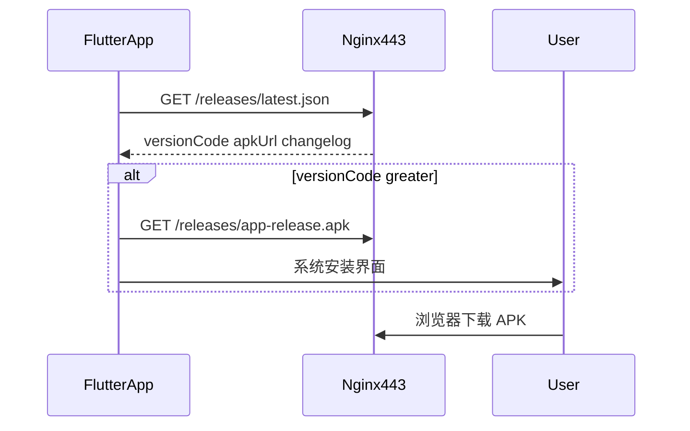

# APK 整包自动更新与服务器下载

## 能力边界（已确认）

采用 **APK 整包 OTA**（非 Shorebird 代码热补丁）：

- 启动后请求服务器 `latest.json`，比较 `versionCode`（来自 [`apps/mobile/pubspec.yaml`](apps/mobile/pubspec.yaml) 的 `+N`）
- 有新版本则提示下载 → 安装（覆盖安装，签名须与旧包一致；当前 release 使用同一 debug 签名，满足要求）
- 浏览器访问：`https://124.220.36.45/releases/app-release.apk`（与 API 同域，走现有 Nginx 443）



---

## 1. 服务器：静态发布目录 + Nginx

**目录（服务器）**：`/var/www/chat-releases/`（或 `~/myapp/ChatApp/releases/`）

| 文件 | 说明 |
|------|------|
| `app-release.apk` | 当前正式包（固定文件名，便于链接） |
| `latest.json` | 版本元数据 |

**`latest.json` 示例**：

```json
{
  "versionName": "0.1.1",
  "versionCode": 2,
  "apkUrl": "https://124.220.36.45/releases/app-release.apk",
  "changelog": "修改昵称；实时消息修复",
  "forceUpdate": false
}
```

**Nginx**（扩展 [`deploy/nginx/chatapp.conf`](deploy/nginx/chatapp.conf) 的 HTTPS `server` 块）：

```nginx
location /releases/ {
    alias /var/www/chat-releases/;
    autoindex off;
    add_header Cache-Control "no-cache";
    types { application/vnd.android.package-archive apk; }
    default_type application/octet-stream;
}
```

- 下载地址：`https://<CORS_ORIGIN 主机>/releases/app-release.apk`
- 清单地址：`https://<主机>/releases/latest.json`
- 无需单独开端口；若坚持「IP:端口」，可另开 `listen 8080` 静态站，但会与 HTTPS 证书、防火墙重复配置，**不推荐**，计划中默认同域 `/releases/`

**可选轻量 API**（非必须）：`GET /app/release/latest` 在 Nest 读同目录 JSON——仅当希望统一走 API 域名时再加；**优先 Nginx 直出**，避免 87MB 流经 Node。

---

## 2. 发布脚本（本地 → 服务器）

新增 [`scripts/publish-apk.ps1`](scripts/publish-apk.ps1)：

1. 调用现有 [`scripts/build-apk.ps1`](scripts/build-apk.ps1)（或 `-SkipBuild` 仅上传）
2. 根据 `pubspec.yaml` 的 `version: x.y.z+N` 生成 `deploy/releases/latest.json`（`apkUrl` 取自 `deploy/.env` 的 `CORS_ORIGIN`）
3. `scp` 到 `tencent:~/myapp/ChatApp/releases/`（或 `/var/www/chat-releases/`）
4. SSH 同步到 Nginx `alias` 目录并重载 `nginx -s reload`

在 [`DEPLOY.md`](DEPLOY.md) 增加「发布客户端」小节：每次发版前将 `pubspec.yaml` 的 `+versionCode` 加 1。

---

## 3. Flutter 客户端

**依赖**（[`apps/mobile/pubspec.yaml`](apps/mobile/pubspec.yaml)）：

- `package_info_plus` — 读取本机 `versionCode` / `versionName`
- `path_provider` + `dio`（已有）— 下载 APK 到缓存目录
- `open_filex` 或 `android_intent_plus` — 调起 Android 安装器

**配置**（[`apps/mobile/lib/config/app_config.dart`](apps/mobile/lib/config/app_config.dart)）：

- `UPDATE_MANIFEST_URL`，默认 `{API_BASE_URL}/releases/latest.json`（与 API 同服）

**新服务** [`apps/mobile/lib/services/app_update_service.dart`](apps/mobile/lib/services/app_update_service.dart)：

- `checkForUpdate()` → 解析 `latest.json`，`remote.versionCode > local.versionCode` 则返回更新信息
- `downloadAndInstall(apkUrl, onProgress)` → 下载后 `OpenFile.open` / `ACTION_VIEW` 安装

**触发时机**（[`apps/mobile/lib/app_shell.dart`](apps/mobile/lib/app_shell.dart)）：

- `bootstrapAuth` 完成后、`authReady == true` 时后台检查一次（不阻塞登录）
- 有更新：对话框展示 `changelog`；`forceUpdate: true` 时不可取消
- 「我」页可增加一行：当前版本号 +「检查更新」

**Android 配置**（[`apps/mobile/android/app/src/main/AndroidManifest.xml`](apps/mobile/android/app/src/main/AndroidManifest.xml)）：

- `REQUEST_INSTALL_PACKAGES`（Android 8+ 侧载安装）
- `FileProvider` + `xml/file_paths.xml`（Android 7+ 通过 `content://` 安装，避免 `file://` 限制）

---

## 4. 版本与签名约定

| 项 | 要求 |
|----|------|
| 每次发版 | `pubspec.yaml` 中 `+versionCode` 递增（如 `0.1.0+1` → `0.1.1+2`） |
| 签名 | 保持同一 keystore；换签名会导致无法覆盖安装 |
| 服务器 API | 本次无破坏性变更；仅 Nginx 静态路径，**无需**重建 API 镜像 |

---

## 5. 验收清单

1. 浏览器打开 `https://124.220.36.45/releases/app-release.apk` 能下载
2. `latest.json` 中 `versionCode` 大于已装 APK → App 弹更新
3. 下载完成后出现系统安装界面，覆盖安装成功
4. 将 `versionCode` 调低或改 JSON 测试 `forceUpdate` 行为（可选）

---

## 工作量与风险

- **实现量**：约 1 天（脚本 + Nginx + 客户端更新流程 + 文档）
- **风险**：部分机型需用户允许「安装未知应用」；下载大包（~88MB）建议 Wi‑Fi 提示；自签名 HTTPS 下载沿用现有 `ALLOW_INSECURE_SSL` 逻辑（仅影响 API，APK URL 为同源 HTTPS 一般无此问题）
