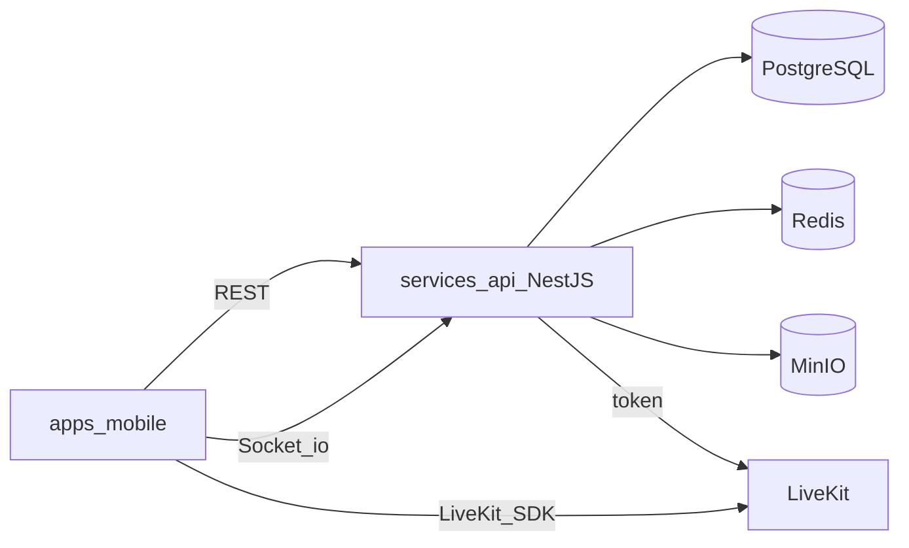
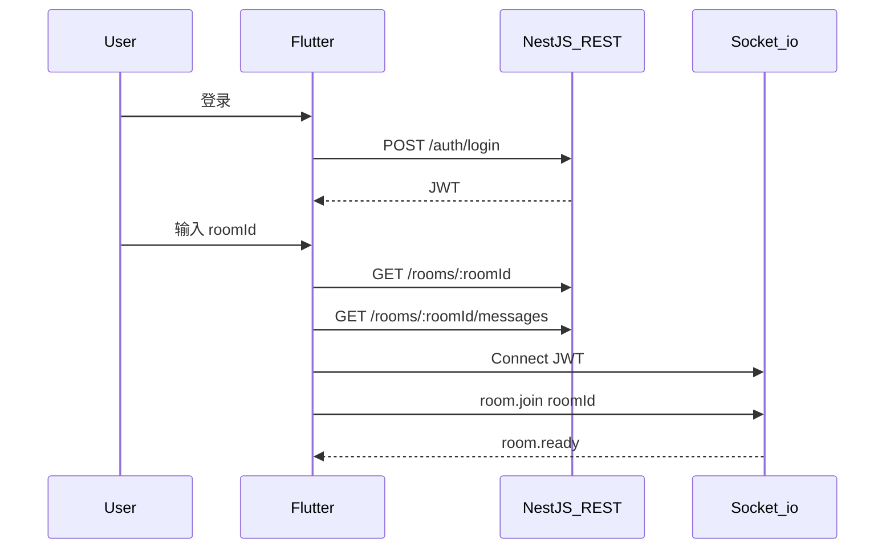

# 跨平台多人聊天室 App — 开发方案

> 最后更新：2026-06-02  
> 技术栈：**Flutter** + **NestJS API**（已确认，未选用 Go）

---

## 1. 需求摘要

| 维度 | 选择 |
|------|------|
| 客户端 | `apps/mobile` — Flutter 3.x（iOS / Android） |
| 服务端 | `services/api` — **NestJS** + TypeScript |
| 产品结构 | **多个多人聊天室**；通过 **`roomId`** 进入对应房间 |
| 明确不做（MVP） | 全局唯一大厅、**1 对 1 私聊** |
| 消息类型 | 文字 + 图片 + 文件 + **语音消息** |
| 实时语音 | **当前房间内**语音连麦（LiveKit） |
| 数据策略 | 云端优先，消息按 `roomId` 隔离持久化 |

**产品形态**：登录 → 输入/选择 **roomId**（或创建房间）→ 进入该房间聊天页。

---

## 2. 技术栈（Flutter + NestJS）



### 2.1 客户端（Flutter）

| 用途 | 依赖包 |
|------|--------|
| HTTP | `dio` |
| 实时 | `socket_io_client` |
| 状态 / 路由 | `flutter_riverpod`, `go_router` |
| Token 存储 | `flutter_secure_storage` |
| 录音 / 播放 | `record`, `just_audio` |
| 连麦 | `livekit_client` |
| 媒体选择 | `image_picker`, `file_picker` |

### 2.2 服务端（NestJS）

| 用途 | 依赖 |
|------|------|
| 框架 | `@nestjs/core`, `@nestjs/config` |
| 数据库 | `prisma`, PostgreSQL |
| 认证 | `@nestjs/jwt`, `bcrypt` |
| 实时 | `@nestjs/websockets`, `@nestjs/platform-socket.io`, `@socket.io/redis-adapter` |
| 缓存 | `ioredis` |
| 对象存储 | MinIO / `@aws-sdk/client-s3`（presign） |
| 连麦 Token | `livekit-server-sdk` |
| 校验 | `class-validator` |

**选型说明**：NestJS 生态成熟（Socket.io + Prisma），MVP 开发更快；Go 在极高并发场景更优，本项目 MVP 不选用。

### 2.3 Monorepo 目录

```
f:\_app\
├── apps/mobile/              # Flutter
├── services/api/             # NestJS
├── packages/
│   ├── openapi/              # REST 契约
│   └── ws-events/            # Socket.io 事件文档
├── docs/
│   └── DEVELOPMENT_PLAN.md   # 本文件
├── docker-compose.yml        # postgres, redis, minio, livekit, coturn
└── README.md
```

**本地启动**

1. `docker compose up -d`
2. `cd services/api && npm run start:dev`（默认 `http://localhost:3000`）
3. `cd apps/mobile && flutter run`（配置 `API_BASE_URL`、`WS_URL`）

---

## 3. 系统架构

### 3.1 按 roomId 进入房间



### 3.2 领域模型（Prisma）

- **User** — id, nickname, avatarUrl
- **Room** — id (roomId), title, createdBy, createdAt
- **RoomMember** — roomId, userId, joinedAt
- **Message** — roomId, senderId, type, content, attachmentUrl, attachmentMeta (JSON), **seq**, createdAt

**Message.type**：`text` | `image` | `file` | `voice`

**权限（MVP）**：知道 `roomId` 即可 `POST /rooms/:roomId/join` 后发言（会议号模式）；二期可加房间密码。

**Redis**

- Socket.io：`@socket.io/redis-adapter` 多实例广播
- 可选：`room:{roomId}:online`、`INCR room:{roomId}:seq`

---

## 4. NestJS 模块

```
services/api/src/
├── auth/
├── users/
├── rooms/
├── messages/
├── uploads/
├── realtime/     # Socket.io Gateway
├── voice/        # LiveKit token
└── prisma/
```

---

## 5. API 与 WebSocket 契约

### REST

| 方法 | 路径 | 说明 |
|------|------|------|
| POST | `/auth/register`, `/auth/login`, `/auth/refresh` | 认证 |
| POST | `/rooms` | 创建房间，返回 roomId |
| GET | `/rooms/:roomId` | 房间信息 |
| POST | `/rooms/:roomId/join` | 加入房间 |
| GET | `/rooms/recent` | 最近访问房间 |
| GET | `/rooms/:roomId/messages` | 历史消息 `?before=&after=&limit=` |
| POST | `/rooms/:roomId/uploads/presign` | 媒体上传预签名 |
| POST | `/rooms/:roomId/voice/token` | LiveKit Join Token |
| PATCH | `/users/me` | 昵称 / 头像 |

### Socket.io 事件

| 方向 | 事件 | 说明 |
|------|------|------|
| C→S | `room.join` | roomId 必填 |
| C→S | `room.leave` | roomId |
| S→C | `room.ready` | 已加入 |
| C→S | `message.send` | roomId, type, content, attachment |
| S→C | `message.new` | 含 roomId, seq |
| C→S | `call.join` / `call.leave` | roomId |
| S→C | `call.state` | 连麦列表 |
| S→C | `presence.update` | 可选 |

**MVP 不做**：私聊 `/conversations`、`/dm/*`。

### 语音消息示例

```json
{
  "type": "voice",
  "attachmentUrl": "https://...",
  "attachmentMeta": {
    "mime": "audio/m4a",
    "durationSec": 12,
    "size": 48000
  },
  "seq": 1206,
  "roomId": "..."
}
```

---

## 6. Flutter 页面（MVP）

```
LoginPage
    ↓
RoomHubPage       # 输入 roomId、最近房间、创建房间
    ↓ roomId
ChatPage(roomId)  # 消息 + 输入 + 连麦
SettingsPage      # 可选
```

切房时：先 `room.leave` 旧 id，再 `room.join` 新 id；Riverpod 以 `roomId` 为 key。

---

## 7. 分阶段实施计划

| Phase | 内容 | 工期 |
|-------|------|------|
| **0** | Monorepo、`nest new`、`flutter create`、docker-compose、Prisma schema、`GET /health` | 3–5 天 |
| **1** | Auth、JWT、WS 握手鉴权 | 4–6 天 |
| **2** | Rooms 模块、Flutter RoomHub | 5–7 天 |
| **3** | Socket.io Gateway、消息历史、Redis adapter | 7–10 天 |
| **4** | presign、图片/文件/语音消息（语音最长 60s） | 8–12 天 |
| **5** | LiveKit + coturn、`voice/token`、连麦 UI（单房默认 9 人） | 10–15 天 |
| **6** | FCM/APNs、限流、隐私政策、内测 | 5–7 天 |

**总工期**：约 **7–10 周**（1 人全栈）

---

## 8. 非功能需求

- 索引：`(room_id, seq)` 唯一；`room_members(user_id, joined_at)`
- 限流：每用户每房间发消息频率
- `roomId`：UUID v4 或 nanoid，不可猜测
- 连麦 MVP 不录制；需麦克风权限说明

---

## 9. 风险与后续扩展

**风险**

- roomId 泄露即可进房 → 二期房间密码
- seq 并发 → 事务或 Redis INCR
- Nest 单进程连接数 → 尽早 Redis Adapter + 水平扩展

**二期**

- 1 对 1 私聊、房间密码、禁言、视频连麦、消息撤回、@提及

---

## 10. 实施 checklist

- [ ] Phase 0：脚手架与 docker
- [ ] Phase 1：认证
- [ ] Phase 2：房间与进房
- [ ] Phase 3：实时文字
- [ ] Phase 4：媒体与语音消息
- [ ] Phase 5：语音连麦
- [ ] Phase 6：上线准备
